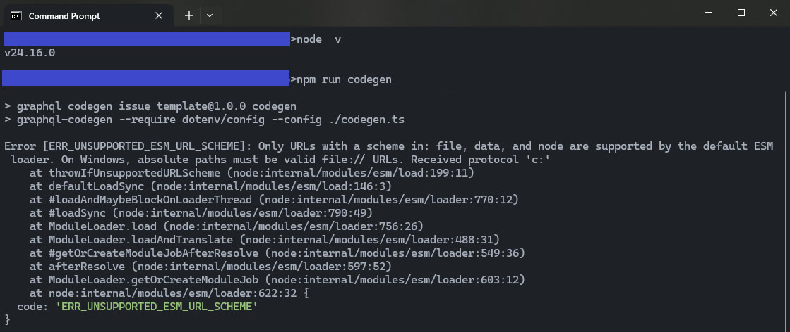

# `graphql-code-generator/cli` code error reproduction

Issue: [#10842](https://github.com/dotansimha/graphql-code-generator/issues/10842#issuecomment-4564501409)

## Setup

1. Use Windows 10, Node v24.16.0
2. `npm install`
3. `npm run codegen`

## Result

```console
Error [ERR_UNSUPPORTED_ESM_URL_SCHEME]: Only URLs with a scheme in: file, data, and node are supported by the default ESM loader. On Windows, absolute paths must be valid file:// URLs. Received protocol 'c:'
    at throwIfUnsupportedURLScheme (node:internal/modules/esm/load:199:11)
    at defaultLoadSync (node:internal/modules/esm/load:146:3)
    at #loadAndMaybeBlockOnLoaderThread (node:internal/modules/esm/loader:770:12)
    at #loadSync (node:internal/modules/esm/loader:790:49)
    at ModuleLoader.load (node:internal/modules/esm/loader:756:26)
    at ModuleLoader.loadAndTranslate (node:internal/modules/esm/loader:488:31)
    at #getOrCreateModuleJobAfterResolve (node:internal/modules/esm/loader:549:36)
    at afterResolve (node:internal/modules/esm/loader:597:52)
    at ModuleLoader.getOrCreateModuleJob (node:internal/modules/esm/loader:603:12)
    at node:internal/modules/esm/loader:622:32 {
  code: 'ERR_UNSUPPORTED_ESM_URL_SCHEME'
}
```

## Screenshot


